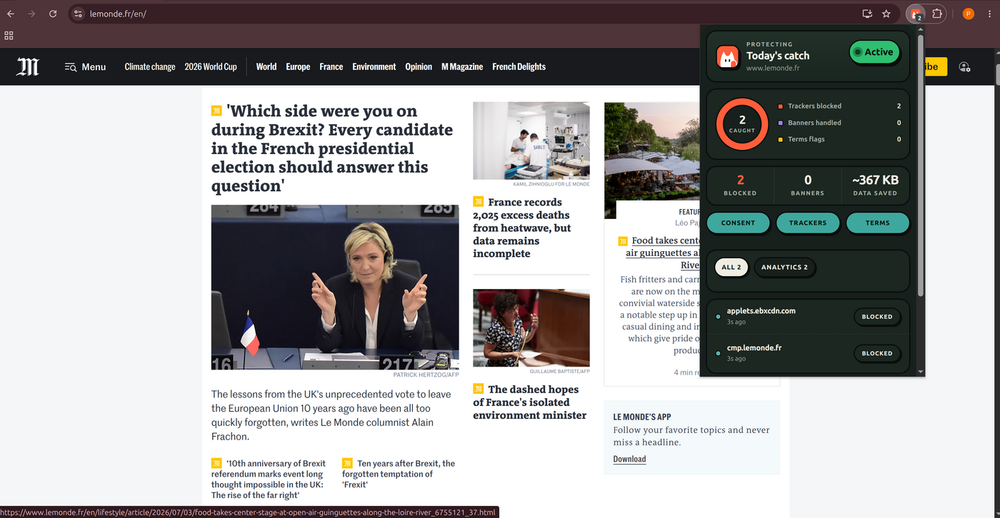
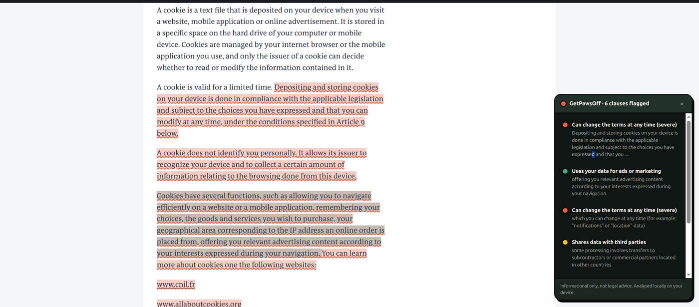

# GetPawsOff

A small, local-first privacy extension for Chrome (Manifest V3). It auto-rejects
cookie banners, blocks tracking pixels in webmail, and flags shady Terms of
Service clauses. Everything runs on your device: no accounts, no telemetry, no
server. The only optional network call is a signed rules update, see
[Privacy](#privacy) below.

## What it does

- **ConsentGhost**: auto-rejects cookie-consent banners. Only ever declines
  or stands down, never clicks "Accept" for you.
- **PixelBlock**: blocks tracking pixels in supported webmail (Gmail,
  Outlook, Proton, Yahoo, Fastmail, and others).
- **ToS Shield**: scans Terms of Service / privacy pages and flags sketchy
  clauses (data resale, forced arbitration, silent changes, etc).
- **Network tracker blocking**: a bundled EasyPrivacy ruleset blocks known
  trackers at the network level.
- **Local tracker learner**: an on-device, Privacy Badger-style heuristic
  that learns which third parties follow you across sites. Observe-only for
  now, doesn't block anything on its own yet.

## Privacy

- Runs on your device. State lives in `chrome.storage.local`, nothing is
  sent anywhere.
- Sites are recorded as a one-way hash, never a plaintext URL or history.
- No analytics, no telemetry, no beacons.
- One optional exception: it can fetch a *signed* rules update from
  `config.getpawsoff.app`. Read-only, verified against a pinned key, and
  falls back to the bundled rules if anything about that fetch fails. See
  [`docs/CLOUDFLARE_SETUP.md`](docs/CLOUDFLARE_SETUP.md) if you want the
  details or want to self-host your own feed.

## Permissions, explained

Chrome will warn that this extension can "read and change all your data on
all websites." That's the standard warning for any content-blocker; here's
what each permission is actually for:

- **`http://*/*`, `https://*/*` (host permissions)**: cookie banners and
  trackers show up on any site, not a fixed list, so ConsentGhost and the
  tracker blocker need to run everywhere. No page content is read or sent
  anywhere, see [Privacy](#privacy).
- **scripting**: injects the content scripts (banner rejection, pixel
  blocking, ToS scanning) into the page.
- **declarativeNetRequest** / **declarativeNetRequestFeedback**: lets
  Chrome block known trackers itself using the bundled EasyPrivacy
  ruleset; the extension never sees the blocked requests' contents.
- **webRequest**: only used to spot tracking-pixel requests in supported
  webmail so PixelBlock can flag/block them.
- **tabs** / **activeTab**: shows the per-tab blocked-tracker count in the
  toolbar badge and popup.
- **alarms**: schedules the periodic signed rules-update check.
- **storage**: settings and activity counts live in
  `chrome.storage.local`, nothing is sent off the device.

## Install

1. Open `chrome://extensions`.
2. Turn on **Developer mode**.
3. Click **Load unpacked** and select this folder.
4. The paw icon shows up in the toolbar. Open the popup to see activity, or
   the options page to toggle things per site.

## Screenshots

Popup, live on lemonde.fr:

ToS Shield flagging clauses on a real privacy policy page:

## Known limitations

Early days (v0.1.0). It's had real testing but not exhaustive testing across
every site/CMP out there, so it may still have bugs or miss edge cases. If
something breaks a site, use "Pause on this site" in the popup or the paused
sites list in options, and feel free to open an issue.

## Licensing

GetPawsOff's own code is under [`LICENSE`](LICENSE) (MPL-2.0). Bundled
third-party data (DuckDuckGo autoconsent, EasyPrivacy) keeps its own license,
see [`THIRD-PARTY-NOTICES.md`](THIRD-PARTY-NOTICES.md).

"GetPawsOff" and its logo are the project's name/branding, please don't reuse
them without asking.

## About

Just a solo side project I've been chipping away at in my spare time, using
some AI pair-programming along the way to move faster.
